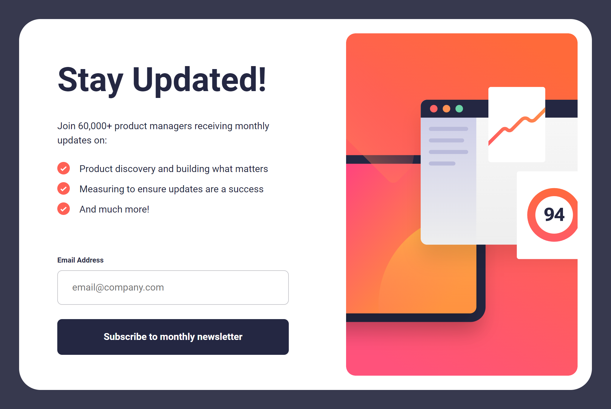

# Frontend Mentor - Newsletter sign-up form with success message solution

This is a solution to the [Newsletter sign-up form with success message challenge on Frontend Mentor](https://www.frontendmentor.io/challenges/newsletter-signup-form-with-success-message-3FC1AZbNrv). Frontend Mentor challenges help you improve your coding skills by building realistic projects. 

## Table of contents

- [Overview](#overview)
  - [The challenge](#the-challenge)
  - [Screenshot](#screenshot)
  - [Links](#links)
- [My process](#my-process)
  - [Built with](#built-with)
  - [What I learned](#what-i-learned)
  - [Continued development](#continued-development)
  - [Useful resources](#useful-resources)
- [Author](#author)
- [Acknowledgments](#acknowledgments)

**Note: Delete this note and update the table of contents based on what sections you keep.**

## Overview

### The challenge

Users should be able to:

- Add their email and submit the form
- See a success message with their email after successfully submitting the form
- See form validation messages if:
  - The field is left empty
  - The email address is not formatted correctly
- View the optimal layout for the interface depending on their device's screen size
- See hover and focus states for all interactive elements on the page

### Screenshot

### Links

- [Solution URL](https://github.com/ralphvirtucio/newsletter-sign-up)
-  [Live Site URL](https://ralphvirtucio.github.io/newsletter-sign-up/)

## My process

### Built with

- Semantic HTML5 markup
- CSS custom properties
- Flexbox
- CSS Grid
- Mobile-first workflow
- SASS

### What I learned

I learned client-side form validation and sending form data

### Continued development

I want to continue focusing my client-side form validation, I want to cover all scenarios with the input. I'll be focusing in client form validation and sending form data in my future projects

### Useful resources

- [Client-side Form Validation](https://developer.mozilla.org/en-US/docs/Learn/Forms/Form_validation) - This helped me for Client-side form validation.

- [Sending form data](https://developer.mozilla.org/en-US/docs/Learn/Forms/Sending_and_retrieving_form_data) - This helped me to understand the sending form data, which helps me to resolve my issue with redirecting the main HTML to Thank you page HTML.

## Author

- Frontend Mentor - [@ralphvirtucio](https://www.frontendmentor.io/profile/ralphvirtucio)

